# Demo scenarios

The RDF Graph Visualizer is a tool to visualize RDF graphs using d3js. There are two main use cases I would like to present. All you need to start using it are a Stardog endpoint that can be reached from your network and a database with the data you want to visualize.

First, though, I would like to introduce you to the basics of using this application.

## Settings

When first starting the application, you will be greeted by the settings menu. It allows you to configure the application to your liking and most settings will be saved automatically. The only exceptions are the password for the SPARQL endpoint, the node capacity and the optons to toggle node and link texts which are only persisted until you end a session (close all browser tabs with the application).

All options are explained in the application. Text-based options explain their purpose in placeholders, e. g., username and password, and options that require further information have a tooltip right next to them which shows an in-depth explanation when your cursor hovers over it:

For further explanations of the configuration options, please see the [documentation](../README.md).

## Application features

The main feature of the application is visualizing RDF graphs based on the data provided by a Stardog SPARQL endpoint.

Initally, the graph is collapsed until the number of visible nodes is smaller than or equal to the node capacity setting.

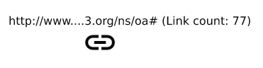

This graph visualizing supports a few quality-of-life features:

* Focus on what you're interested in. You can
  * zoom using a mousewheel,
  * navigate around the graph when holding your left mouse button down,
  * expand and collapse nodes by double-clicking on them,
  * drag nodes by holding you left mouse button down on them,
  * highlight nodes by clicking on them,
  * set a source node in the settings which will be used as the origin when collapsing nodes,
  * set a specific graph in the settings,
  * filter out nodes and links using a black- and whitelist,
  * toggle node and link texts in the settings.
* Notice details at a glance because
  * the amount of links any node has is shown next to its value,
  * different icons are used for URI and literal values,
  * the direction of a relationship is shown using arrowheads,
  * nodes with a `foaf:depiction` relation use the image at the object URI instead of the icon,
  * you can define prefixes to shorten node and link texts, making long URIs much easier to understand and groups easier to identify (The top prefixes from prefix.cc can be used as a default).

## Use Case 1 - Visualizing Your Graph

You may want to visualize your graph nicely, filtering out any uninteresting nodes, highlighting noteworthy relationships and arranging your graph to be both visually pleasing and easy to understand.

To illustrate how that can be accomplished using this tool, I will explain the steps required to visualize all "Question" triples related to qanary

1. Enter your SPARQL endpoint ([http://demos.swe.htwk-leipzig.de/](http://demos.swe.htwk-leipzig.de/)), database (qanary), credentials (omitted in this image) and graph URI (urn:graph:f95bb21a-1b43-4de6-9260-5424e4a80ec6) into the settings.

    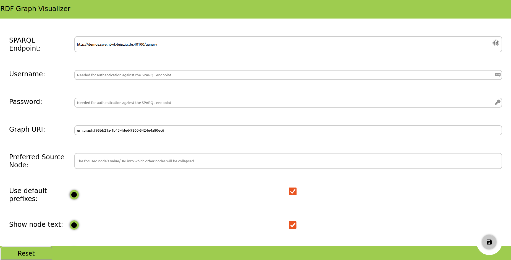

2. Enter "qanary" into the whitelist

    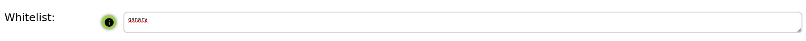

3. Switch to graph view

    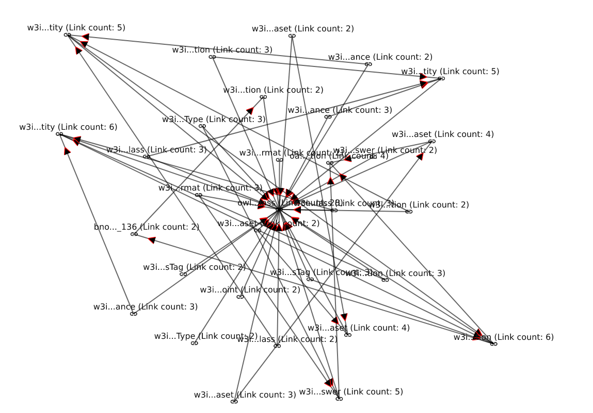

4. Highlight all "Question" nodes by clicking on them (You can zoom in and out or navigate by dragging or you could simply use a more restrictive filter such as `qanary.*question`)

    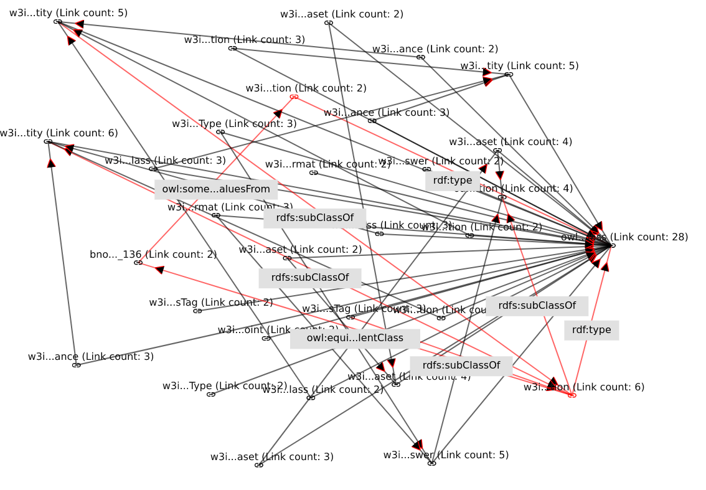

5. Arrange the nodes as you like and zoom in on the relevant nodes

    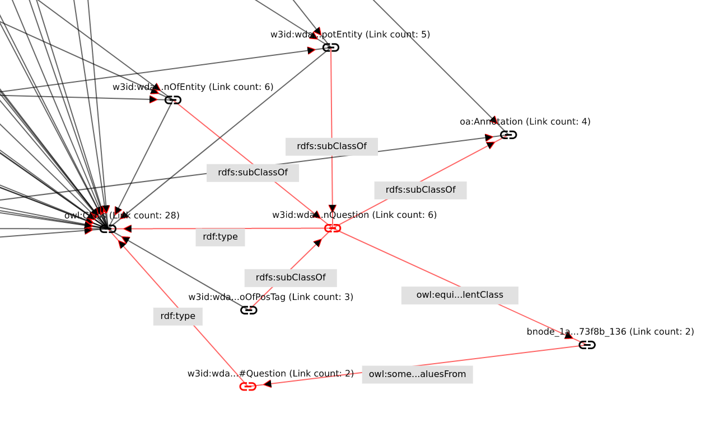

6. Here are a few alternative results depending on the settings and whitelist filter:

    
    RDF Prefixes: default

    Whitelist: qanary.*question

    Show node text: no

    Show link text: yes

    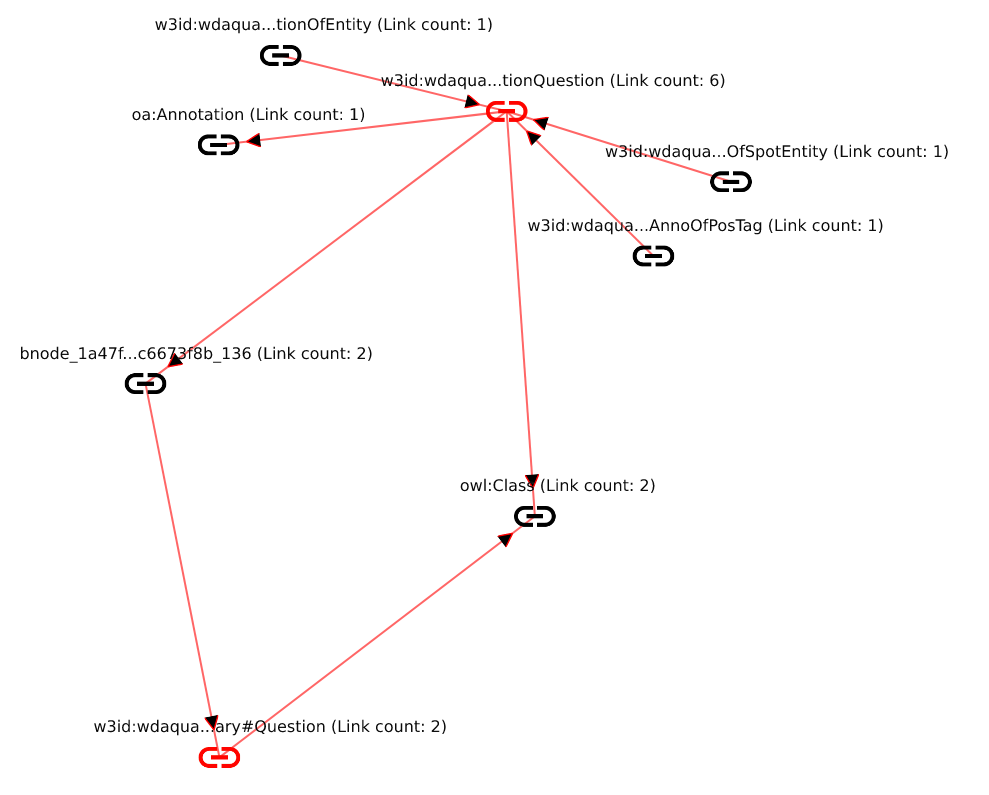
    RDF Prefixes: default

    Whitelist: qanary.*question

    Show node text: yes

    Show link text: no

    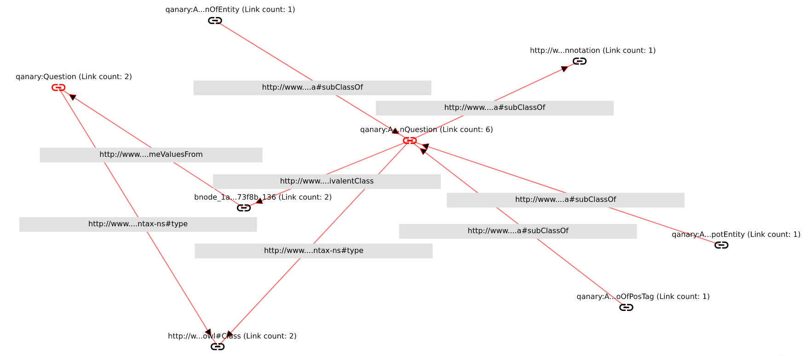
    RDF Prefixes: `PREFIX qanary:     <https://w3id.org/wdaqua/qanary#>`

    Whitelist: qanary.*question

    Show node text: yes

    Show link text: yes

## Use Case 2 - Identifying Issues With Your Graph

Issues with graphs tend to depend on the specifics of the use case, so the best people to discover them are the developers. By visualizing a graph, it can become much easier to spot issues from unconnected nodes over unwanted or misdirected relations to typos or semantic issues.

Here are some common examples of issues that can easily be spotted using this tool:

* Isolated nodes 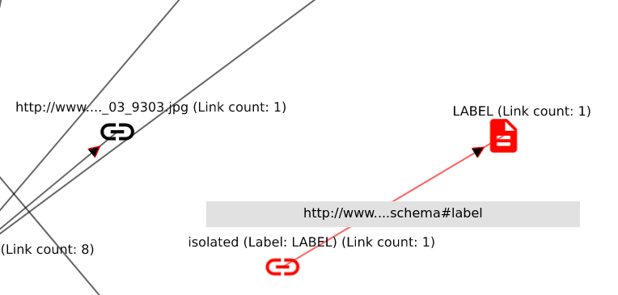

* Misdirected relations 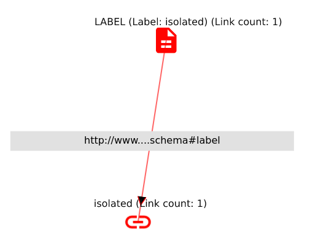

* Spelling mistakes 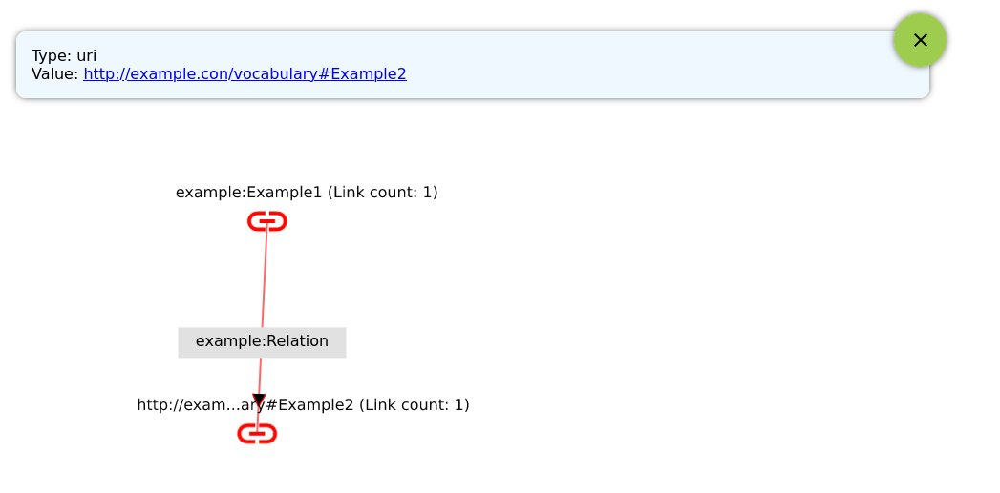
